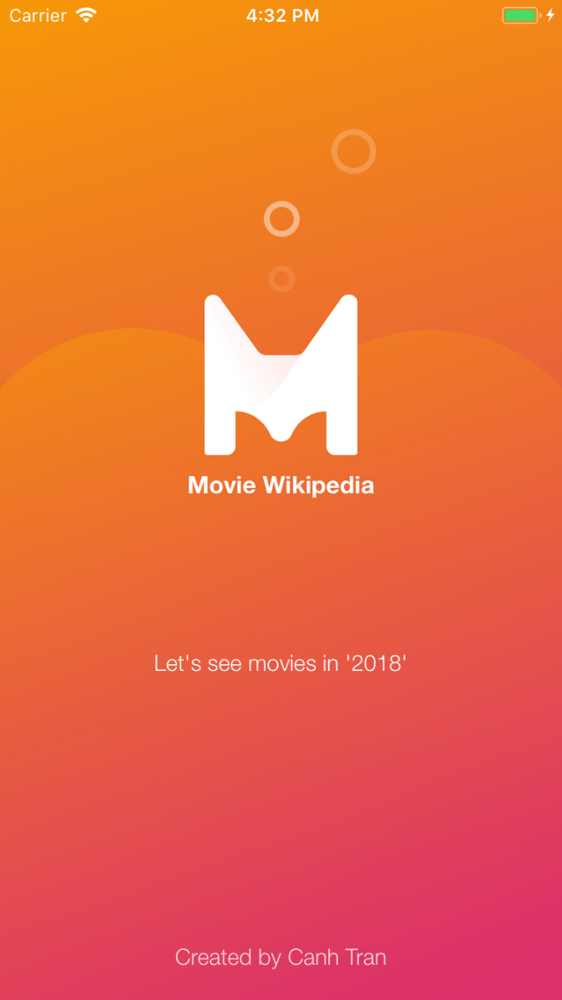
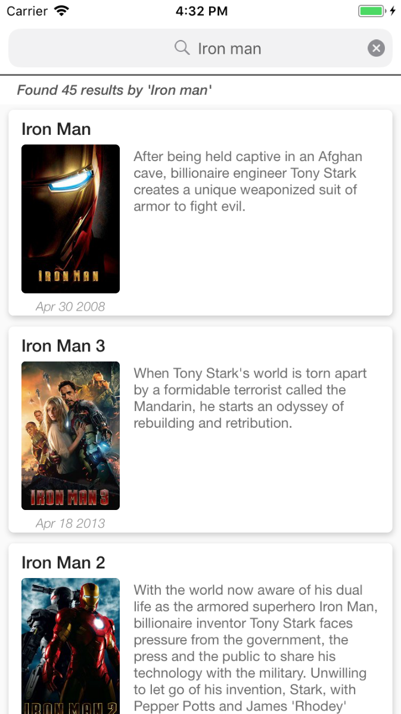
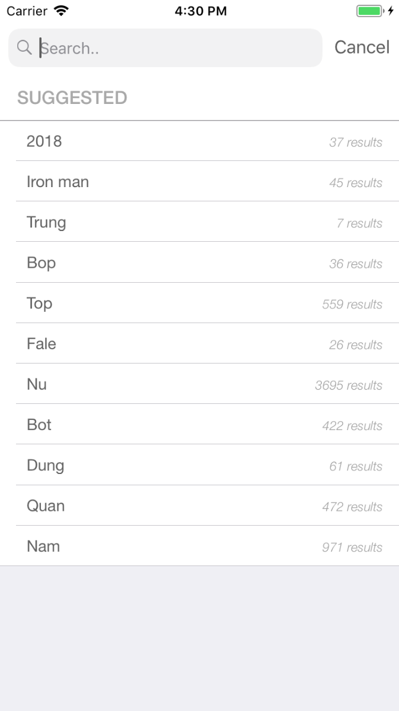

# Movie Wikipedia App

##### We are going to create a simple Movie wikipedia app that has a movies listing screen. It has list suggestions, lazy loading paging on list movies.

## Technical notes: 
 - Swift version 4.0
 - Xcode 9.2
 - MVVM pattern and reactive programing (RxSwift)
 - Use RealmSwift for store Data
 - My Networking library 'CT_RESTAPI' (Coable Swift 4 or ObjectMapper)
 - Including UnitTests, Mocking for SearchServiece
 - Including UITests for Searching.
 - There is no need to install Pods (I commited all already)

### Images:

  

 Launch sceen 

  

 Movie results 

  

 Suggestions list 

 
